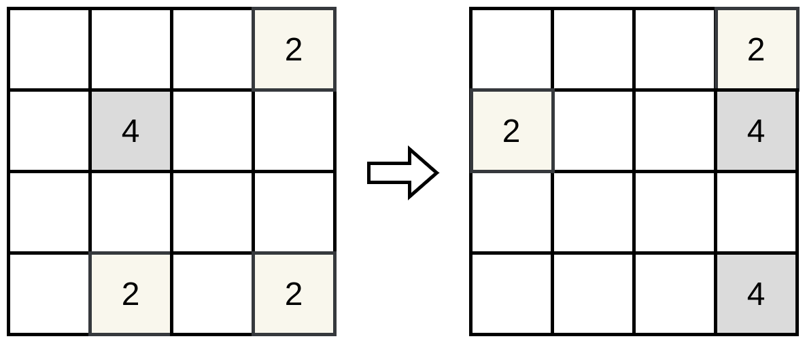

# Playing 2048, a reinforcement learning approach

Authors:\
&emsp;[**Pasianotto Isac**](https://github.com/IsacPasianotto/)\
&emsp;[**Paglierani Yuri**](https://github.com/YuriPaglierani)\
Date:\
&emsp;2023-07-21

## What is 2048?

It is a single-player game where the player has to slide tiles on a grid to combine them and create a tile with the number 2048. The game is played on a 4x4 grid, which is initially filled with two tiles, and every turn a new tile with the number 2 or more rarely 4 appears at a random empty spot on the board.\
The player can slide the tiles in four directions: up, down, left, and right, the slide operation moves the tiles as far as possible in the chosen direction until they are stopped by either another tile or the edge of the grid. If two cells with the same number collide while moving, they will merge into a tile with the sum of their two values, and the total score is incremented by the amount of the newly formed tile. The resulting tile cannot merge with another tile again in the same move. Note that due to the game rules, the board will always be filled with tiles with a power of 2.

*Fig. 1: example of a move "right" performed on a board*

We say that the game is won when a tile with a value of 2048 appears on the board (In the original game the player can continue to play after reaching the 2048 tile to reach higher scores). A game is lost if the player cannot make a valid move anymore, that happens when the board is filled with tiles and no adjacent tiles with the same value are present.
We will define a move *valid* if it produces a change in the board state, otherwise, it is *invalid*.

*Fig. 2: example of a game over state: no valid actions are available*

## Model of the environment

In order to implement the environment, we have taken into account two different strategies:

- A 2D array of integers, where each integer represents the value of the tile in that position, and 0 represents an empty tile.
- A 3D array of size 12x4x4, where the first dimension represents the value of the tile, and the second and third dimensions represent the position of the tile on the board.

After some tests, we have decided to use the first approach, since it seems slightly more efficient in terms of speed execution.
Anyway as we will see later, we have implemented a function that allows us to convert the 2D array into a 3D array when it was more convenient to use it.

The environment implementation is done with the [`Game2048` class](modules/envs.py) which extends the [`gym.Env` class](https://gymnasium.farama.org/api/env/).

## Reinforcement learning framework

### Action space

action space $A$ is **discrete**, but we defined it as not constant over time. In fact, in a given state $s$ the agent could have a different number of actions available, depending on the board configuration. In any case, it holds that

$$
A(s) \subseteq \mathcal{A} = \{\texttt{up},\ \texttt{down},\ \texttt{left},\ \texttt{right}\}\qquad \forall \ s \in S
$$

Another choice could have been to define the action space constant in time and always equal to $\mathcal{A}$, but we have decided to not do it trying to reduce the complexity of the problem and to make the agent learn faster.

All the actions are **deterministic**, which means that the agent can choose an action, and the environment will perform it with $\Pr(\text{action}=\text{execution})=1$.

### State space

The possible states $s$ which populate the state space $S$ are **discrete** and **finite**. The exact cardinality of $S$ is not trivial to compute, however, we can give an upper bound. In fact, considering that there are 16 tiles on the board, each of them can have a value between 0 and 2048 (that means 12 possible values), assuming that the tiles are independent, we can say that the cardinality of $S$ is at most $12^{16}$.
This estimation is not precise, since it does not take into account some impossible configurations but it is good enough for giving an idea of the order of magnitude of $S$, which is still very huge.

### Reward

In a 2048 game, the score is incremented by the number of new tiles formed by the merging of two tiles. Similar behavior is reasonable for the reward we assign to the agent. In fact, we want the agent to maximize the score and try to reach tiles with values as high as possible.

In order to have a more uniform reward distribution, we have implemented the possibility to consider the logarithm in base 2 of the new tile value as the reward. In this way, the reward obtained by a merge is always between 1 and 11. The behavior of the reward function is controlled by the parameter `log_rewards` of the environment class `Game2048`: 

$r = \text{new tile value}$ if `log_rewards` is `False`\
$r = \log_2(\text{new tile value})$ if `log_rewards` is `True`

Even if we have not considered it in our results (due to time constraints) we've implemented the possibility to assign a negative reward to the agent when it performs an action. That is done by setting the parameter `penalty_move` in the [agent class used](modules/agents.py) (with a positive value, the program will subtract that value). The idea is to encourage the agent to perform principally moves that lead to a merge of tiles, and not moves that simply shift the tiles without any merge; moreover, we forced the model to reach tiles with higher values by adding a **reward per action** when we reach values greater or equal to 512, in particular for each step, we reward the agent with an additional value of num_tiles==512 + 2.5*num_tiles==1024 + 6*num_tiles==2048.

Note that due to the fact that at each step the agent can only perform a valid move, and after every move, a new tile is added to the board, the existence of a terminal state is guaranteed, so considering a 0 value for penalty is not a problem.

## Solving the problem

### Model-based or model-free?

The problem is so complex that we can state we have no a priori knowledge of the transition probabilities $p(s'|s, a)$, which makes unfeasible computing also the expected reward $\mathbb{E}[r|s, a] = \sum_{s'} p(s'|s, a) r(s, a, s')$.

For this reason, the choice was to use a model-free approach, where the agent learns the optimal policy $\pi^*$ by interacting with the environment and observing the rewards obtained. In this setting, for each episode, there will be generated a sequence of states, actions, and rewards $S_0,\ A_0,\ R_1,\ S_1,\ A_1,\ \dots$, 

### TD-learning

We will stay in the class of *Action-Value methods*. In particular, we will use the **Temporal Difference** (TD) learning algorithm to estimate the optimal action-value function $Q^{\ast}(s, a)$.

$$Q^{\ast(\pi)}  =  \max_{\pi} \ E_{\pi} \left(R_t \vert s_t = s,\ a_t = a \right)$$

$$Q^{\ast(\pi)} =  \ \sum_{s'} p(s'|s,a) \left( r(s,a,s') + \gamma \max_{a'} \pi(a'|s') Q^{\ast(\pi)}(s',a') \right)$$

Where $\gamma$ is the discount factor that encodes the time horizon of the problem.

There are more possible choices: *TD(0)*, TD($\lambda$), and *Monte Carlo* method. We have decided to implement a TD(0) algorithm, which is the simplest one and the cheapest in terms of computational cost.

The TD(0) algorithm is the following:

*Figure 3: TD(0) algorithm pseudocode*

Where $\alpha$ is the learning rate, which controls the step size of the algorithm.

To compute the *temporal difference error* $\delta(S,\ A,\ R, S')$ we have used the following formula: $\delta(S,\ A,\ R, S') = R + \gamma \max_{a'} Q(S',a') - Q(S,A)$, so we have chosen to do a **Q-learning** model.

### DQN: A Q-learning approach with neural networks

In traditional Q-leaning, the action-value function $Q(s, a)$ is represented as a table, where each row is a state $s$ and each column is an action $a$. The Q-function then is a function $Q: S \times A \rightarrow \mathbb{R}$, which is represented as a matrix $Q \in \mathbb{R}^{|S| \times |A|}$.

However, as we already said, the state space $S$ is huge (upper bounded by $12^{16}$), this makes unfeasible the use of a table to represent the Q-function (for both memory and computational reasons). To solve this problem we have used a neural network (which is a universal function approximation) to represent the Q-function.
This approach is called **Deep Q-Network** (DQN), and changes a little bit the setting of problem: we have a neural network  $Q: S \to \mathbb{R}^{|A|}$, which takes as input a state $s$ and outputs a vector of size $|A|$.

*Fig. 4: Difference between traditional Q-learning approach and DQN*

Then the action $a$ is chosen as $\arg\max_{a} Q(s, a)$, which is the index of the maximum value of the output vector of the neural network. The previous pseudo-code can be adapted to this new setting in the following way:

*Fig. 5: DQN algorithm pseudocode*

Where $\theta$ are the parameters of the neural network $Q(s,\theta)$, and $\theta'$ are the parameters of a second neural network $Q(s,\theta')$ which is used to compute the target $y$.

Usually, the TD-learning algorithms are defined considering the *eligibility traces* $e(s, a)$. In this case instead, we have used the *loss* $\mathcal{L}(s,a)$ instead, which is defined as

$$\mathcal{L}(\delta) = \mathcal{L}^{Huber}(\delta(\theta)) + \mathcal{L}^{L2}(\theta)
$$
Where $\mathcal{L}^{Huber}$ is the Huber loss function and $\mathcal{L}^{L2}$ is the L2 regularization term whose are defined as follows:
$$
\mathcal{L}^{Huber}(\delta) = \begin{cases}
\frac{1}{2} \delta^2 & \text{if } |\delta| \leq 1\\
\vert\delta\vert - \frac{1}{2} & \text{otherwise}
\end{cases}
\qquad
\mathcal{L}^{L2}(\theta) = \frac{\lambda}{2} \vert \theta \vert_2^2
$$

We have chosen the Huber loss function since it is more robust to outliers (and as you'll see we have a lot of noise). The relation between the two is the following:

$$
-\nabla_\theta\mathcal{L}(\delta) = \delta(S,\ A,\ R, S') e(S,A)
$$

As written in the algorithm, the agent will take an action with an $\epsilon$-greedy policy, which means that with probability $\epsilon$ it will take a random action, otherwise. The value of $\epsilon$ will decrease over time, in order to make the agent explore the environment at the beginning and exploit the knowledge it has learned later.
Tuning the decay of $\epsilon$ can affect the overall results, for this reason, many different strategies have been proposed. We have decided to implement the following:

- Lai and Robbins: $\epsilon(t(a)) = \frac{\eta}{1+\nu t(a)}$, where $\eta$ and $\nu$ are 0.8 and 0.01 respectively, and $t(a)$ is the number of times the action $a$ has been taken.
- Entropy: $\epsilon$ is computed as the softmax of the scalar product between the valid values of the policy, and $\beta(a) = alpha\cdot \log(t(a)+1)$, where $\alpha$ is 1.
- [Torch documentation](https://pytorch.org/tutorials/intermediate/reinforcement_q_learning.html): epsilon decays exponentially from eps_start to eps_end with eps_decay as rate

The choice of the decay strategy is controlled by the parameter `kind_action` in the agent class, passing one between `lai_robbins`, `entropy`, `torch_version`.

## Implementation

Since this is a project about Reinforcement Learning, the main effort was dedicated to 2 parts: the implementation of the environment and the implementation of the agent.

### Environment

You can find the class of the environment in the [`envs.py`](modules/envs.py) file. The environment is implemented as a class that extends the [`gym.Env` class](https://gymnasium.farama.org/api/env/).

The class has the following attributes:

| attribute       | description                                                                                                                    |
|-----------------|--------------------------------------------------------------------------------------------------------------------------------|
| z `board`       | a 2D array of integers, where each integer represents the value of the tile in that position, and 0 represents an empty tile.  |
| `action_space`  | the action space of the environment, which is a `Discrete` space with 4 possible actions: `up`, `down`, `left`, `right`        |
| `score`         | the current score of the game                                                                                                  |
| `legit_actions` | a numpy array of booleans values with size 4, it represents if an action can be performed or not. For example, if `legit_actions[0]` is `True` then the action `up` can be performed, otherwise, it is not a valid action. |
| `log_rewards`   | a boolean value that controls the reward function, if `True` the reward is the logarithm in base 2 of the new tile value, otherwise the reward is the new tile value. |

The methods and functions of the class are the following:

| method/function                                   | description                                                                                                                                                                                                                                                                                                    |
|---------------------------------------------------|----------------------------------------------------------------------------------------------------------------------------------------------------------------------------------------------------------------------------------------------------------------------------------------------------------------|
| `__init__(self, log_rewards=False)`               | the constructor of the class, it initializes the board and the action space. If `log_rewards` is `True` then the reward is the logarithm in base 2 of the new tile value, otherwise, the reward is the new tile value.                                                                                          |
| `reset(self)`                                     | resets the environment, it sets the board to the initial state and returns the state of the environment.                                                                                                                                                                                                       |
| `step(self, action)`                              | performs the action `action` on the environment, and returns a tuple `(state, reward, done, info)`, where `state` is the new state of the environment, `reward` is the reward obtained by performing the action, `done` is a boolean value which is `True` if the game is over, `info` is an empty dictionary. |
| `get_legit_actions(self)`                         | returns an array of booleans values with size 4, it represents if an action can be performed or not.                                                                                                                                                                                                           |
| `_UP`, `_DOWN`, `_LEFT`, `_RIGHT`                 | function that performs the action `up`, `down`, `left` and `right` respectively. They are used by the `step` method.                                                                                                                                                                                               |
| `_can_UP`, `_can_DOWN`, `_can_LEFT`, `_can_RIGHT` | functions that return `True` if the action `up`, `down`, `left` and `right` respectively can be performed, otherwise it returns `False`                                                                                                                                                                       |
| `_add_random_tile(p)`                             | adds a new tile into a random free position on the board. `p` is the probability of getting a 2 tile (otherwise it will spawn a 4)                                                                                                                                                                             |
| `is_full_board(self)`                             | returns `True` if the board is full, otherwise it returns `False`                                                                                                                                                                                                                                              |
| `is_game_over(self)`                              | returns information about the state of the game (won and/or finished)                                                                                                                                                                                                                                         |

### Agent

For what concern the [`agents.py`](modules/agents.py) module, it contains the implementation of 3 different agents:

- `RandomAgent`: it is an agent that takes random actions among the valid ones at each step. It was used to test the environment and as a baseline for assessing the performance of the other agent.

- `DQN_Agent` and `ConvDQN_Agent`: they are the agents that implement the DQN algorithm. The first one uses a fully connected neural network, while the second one uses a convolutional neural network. The two agents have the same attributes and methods, the only difference is in the neural network used.

The attributes of the `DQN_Agent` and `ConvDQN_Agent` classes are the following:

| Attribute           | Description                                                                                                                                                |
|----------------------|------------------------------------------------------------------------------------------------------------------------------------------------------------|
| `model`              | the model used as a policy network. It must be a model of the [`architectures`](modules/architectures.py) or more in general a sub-class of `torch.nn.Module` |
| `device`             | the device used for computation (cuda or cpu).                                                                                                              |
| `bathc_size`         | the size of the batch used for training.                                                                                                                   |
| `gamma`              | the discount factor of the algorithm.                                                                                                                      |
| `eps_start`          | the starting value of epsilon.                                                                                                                             |
| `eps_end`            | the ending value of epsilon.                                                                                                                               |
| `eps_decay`          | the decay rate of epsilon.                                                                                                                                 |
| `kind_epsg`          | the kind of decay of epsilon, it can be `lai_robbins`, `entropy`, or `torch_version`.                                                                       |
| `tau`                | the parameter used for the soft update of the target network.                                                                                              |
| `lr`                 | the learning rate of the optimizer.                                                                                                                        |
| `replay_memory_size` | The maximum number of transitions to store in the replay buffer.                                                                                           |
| `epochs_checkpoint`  | The number of epochs between two checkpoints (print of information during the training)                                                                    |
| `penality_move`      | The penalty for each move, usable for reward shaping                                                                                                      |
| `target_net`         | The target network used for the soft update.                                                                                                               |
| `policy_net`         | The policy network used for the training.                                                                                                                  |
| `loss_history`       | A list of the loss values obtained during the training.                                                                                                    |
| `cumulative_reward`  | A list of the cumulative reward obtained during the training.                                                                                              |
| `score`              | The score that the agent has achieved playing the game                                                                                                      |
| `steps_done`           | The number of steps done by the agent                                                                                                                      |
| `steps_done`           | The number of steps done by the agent                                                                                                                      |
| `steps_per_action`           | array of size 4 containing the counting of all the  steps the agent did in the game in each direction                                                      |

The methods of the `DQN_Agent` and `ConvDQN_Agent` classes are the following:

| method/function                                                                                                                                                                                                            | description                                                                                                         |
|----------------------------------------------------------------------------------------------------------------------------------------------------------------------------------------------------------------------------|---------------------------------------------------------------------------------------------------------------------|
| `__init__(self, model, device, batch_size=128, gamma=0.99, eps_start=1.0, eps_end=0.01, eps_decay=0.0005, kind_eps='lai_robbins', tau=0.001, lr=0.001, replay_memory_size=10000, epochs_checkpoint=10, penality_move=0.0)` | the constructor of the class, it initializes the attributes of the class.                                           |
| `reset(self)`                                                                                                                                                                                                              | resets the specs of the agent                                                                                       |
| `select_action(self, state, kind)`                                                                                                                                                                                         | selects the action to perform given the state adopting a $\epsilon$ greedy policy whose behaviour depends on `kind` |
| `optimize_model(self)`                                                                                                                                                                                                     | performs the optimization step of the algorithm                                                                     |
| `save(self, path)`                                                                                                                                                                                                         | saves the model at the path `path`                                                                                  |  
| `load(self, path)`                                                                                                                                                                                                         | loads the model from the path `path`                                                                                |
| `binary_tensor(self, state)`                                                                                                                                                                                               | converts the state into a binary tensor with shape (12,4,4) to be used as input of the neural network               |
| `fit(self, env, num_episodes)` | performs the training of the agent for `num_episodes`  |
| `test(self, env, num_episodes)` | plays n_games='num_episodes` by following the learned policy | `

### Results
In this section, we sum up the results obtained by the different agents, in particular, we tried  different decay strategies for epsilon-greedy, different architectures, and different reward shapings (you can find the plots Report.ipynb).
#### Decay strategies
The decay strategies we have tried are:
1. Lai and Robbins, with $\epsilon(a) = \frac{\eta}{1+\nu t(a)}$, $\eta=0.8$ and $\nu=0.01$: this strategy shows some issues in the early stages of the training, in fact, the first move induces a strong bias on the policy (the first moves that are selected have a high probability of being reselected), which makes the agent learn slowly; after some episodes, the agent reach approximately a uniform distribution over the actions. By looking at the mean value of the tiles in the board the agents trained in this way prefer to keep the tiles with big values in the center of the board.
2. Torch Version, with $\epsilon = \epsilon_{end} + (\epsilon_{start} - \epsilon_{end})\cdot e^{-\frac{n}{\epsilon{decay}}}$: this strategy is the one proposed in the Pytorch tutorial, it is the one that makes the agent learn faster, but it is also the one that makes the agent learn less. In fact, the agent trained in this way reaches a uniform distribution over the actions after a few episodes, but it does not learn to keep the tiles with big values in the center of the board; moreover, with this strategy, we don't have the second criterion of convergence, because the asymptotic value of $\epsilon$ is a constant greater than 0.
3. Entropy Regularization, with $\beta(a) = \alpha\log(t(a)+1)$, $\alpha=1$: this strategy was the most interesting one for different aspects. In fact, it makes the agent learn better than the others and the results obtained seem human-like. In this choice, the agent chooses one random move (depending on the initial states in the training) and then forces a hierarchy over the other actions. In particular, if the agent chooses "up" as the main move in the early stage of the training, then it will prefer "left" or "right" as a second main move, and it will avoid "down" as much as possible. This is due to the fact that the agent learns to keep the tiles with big values in the corner of the board, and it learns to merge them or to keep them near and merge them later. Finally, the distribution of the actions is strongly unbalanced, this can be a good thing because it means that the agent has learned to prefer some actions over others.

#### Reward shaping
We propose different reward shapings, we fixed the baseline architecture (BigConvolutionalNetwork), and the entropy regularization:

1. No reward shaping (not tested): the agent learns to reach the 2048 tile, but it does not learn to keep the tiles with big values in the corner of the board, and it does not learn to merge them. The only way to get a reward is to win the game by reaching 2048.
2. Score rewards: for each triple (s, a, s'), the reward corresponds to the sum of the values of the merged tiles in that step (r=4 if we merge 2 tiles of 2s, r=8 if we merge 2 tiles of 4s and so on).
3. Log rewards: for each triple (s, a, s'), the reward corresponds to the sum of the logarithm in base 2 of the values of the merged tiles in that step (r=2 if we merge 2 tiles of 2s, r=3 if we merge 2 tiles of 4s, and so on).
4. Progressive log rewards: as in (3), but this time we rewarded also the presence of tiles bigger or equal to 512, weighted by the number of each tile in the board (matches with big tiles are less probable in the early stages, and we may want to enhance the speed of convergence to those states).
5. Progressive log rewards with penalty: as in (4), but with a penalty of 1.5 for each move.

#### Fully Connected vs Convolutional Neural Networks
In the early stages of the project, we tried to use a fully connected neural network as a policy network, and the board as input. The results were not good (the distribution of the scores was compatible with choosing a random policy), in fact, the agent was not able to learn interesting behaviors, our hypothesis is that the fully connected network is not able to capture that tiles with different values are de facto different objects, and it is not able to capture the spatial information of the board. For this reason, we have decided to convert the board into a binary tensor and to use a convolutional neural network as a policy network. The results were much better, and in this case, we needed less weight, thanks to the weight sharing of the convolutional layers. However, to be fair we compared also the fully connected network with the convolutional one, by using the same binary tensor representation.

#### Conclusions
As you may notice in the Report.ipynb, we do have not (for now) an agent that can win this game, however, this is a good starting point we can use to perform further analysis and to improve the results. In particular, we think that entropy regularization is a good choice, but not the optimal one (when we are in the long-term dynamics it becomes a greedy strategy, and that might be suboptimal), and we can try to improve the results by tuning the reward shaping and the architecture of the network. Moreover, we can try to use a different decay strategy for epsilon-greedy, and we can try to use a different architecture for the network (for example we can try to use a recurrent neural network or a transformer); finally, here we've chosen a TD(0) algorithm, but we can try to use a TD($\lambda$) or a Monte Carlo method to better estimate the future rewards.

## Demo

You can use the [given notebook](./Report.ipynb) to play around with the environment and the agents.\
The notebook contains examples of how to use the modules we implemented in order to train and test the agent. 

Here is a visual example of how the random and the DQN agent play the game:

*Gif 1: Random agent playing a game*

*Gif 2: DQN agent playing a game*

## References

- [2048 game](https://en.wikipedia.org/wiki/2048_(video_game))
- [Pytorch DQN tutorial](https://pytorch.org/tutorials/intermediate/reinforcement_q_learning.html)
- [HuggingFace blog: deep Q-learning](https://huggingface.co/blog/deep-rl-dqn)
- [RL-course](https://www.youtube.com/watch?v=oHHUaFJmON0&list=PLRwcSE2bmyBxc9u_tV65sZTGy729nqgiv&ab_channel=ICTPQuantitativeLifeSciences)

